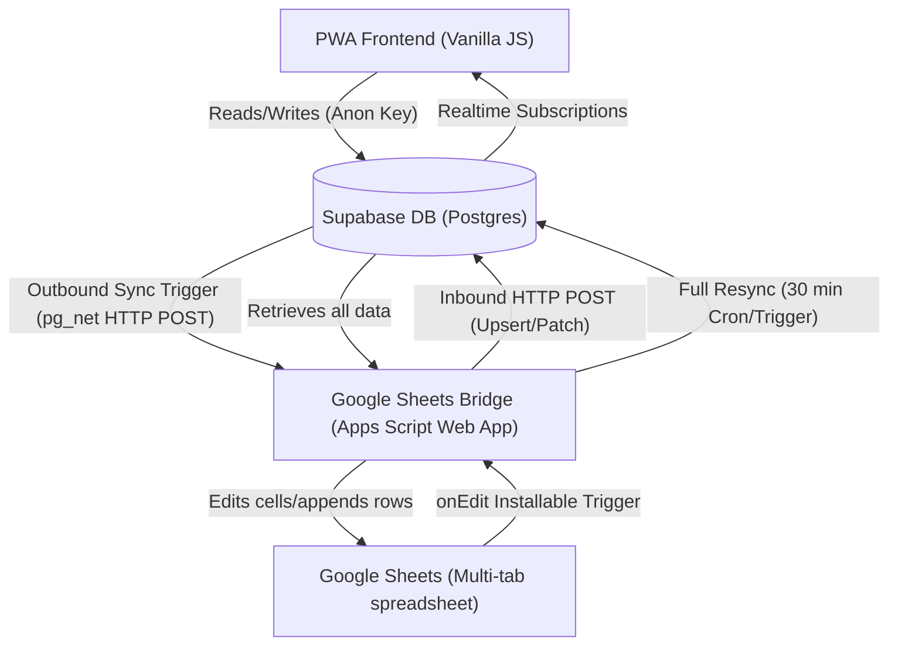

# NRG Caller v2 — Codebase & Project Overview

This document provides a complete guide to the NRG Caller v2 project, detailing its architecture, file structure, database schema, Google Sheets synchronization bridge, PWA frontend modules, and core business rules. 

---

## 1. Project Directory Structure

The repository is organized into the following main directories and files:

```
NRG_Caller/
├── app/                                # Progressive Web App (PWA) Frontend
│   ├── css/
│   │   └── theme.css                   # Theme styles, design tokens, and layout code
│   ├── icons/                          # PWA launcher icons
│   ├── js/
│   │   ├── admin.js                    # Admin dashboard logic (assignment, message, CSV, analytics)
│   │   ├── auth.js                     # Authentication client, login/logout, and session storage
│   │   ├── caller.js                   # Caller workspace, cards, call status select, submission gating
│   │   ├── collection.js               # Lead collection panel, live duplicate checks
│   │   ├── config.js                   # Supabase API connection variables
│   │   ├── main.js                     # Core app router, navigation hooks, initialization
│   │   ├── reception.js                # Reception page, attendee searches, attendance logging
│   │   ├── supabaseClient.js           # Supabase JS Client initialization
│   │   └── utils.js                    # Formatting helpers, debounce, toasts, CSV parsers/exporters
│   ├── index.html                      # PWA single HTML page structure & modals
│   ├── manifest.json                   # Web app manifest for mobile installation
│   └── sw.js                           # PWA Service Worker caching shell files
├── docs/                               # Developer and user guides
│   ├── FEATURES.md                     # Product requirements document (PRD) and feature log
│   ├── JBS_RY_2026_DATA.MD             # Operational execution parameters for campaigns
│   ├── SHEETS_SCHEMA.md                # Mapping of Google Sheets columns and layout tabs
│   ├── SHEETS_SYNC_SETUP.md            # Action items for connecting Sheets to the app
│   └── UI_REFERENCE.md                 # Design specifications & interface guidance
├── sheets-bridge/
│   └── Code.gs                         # Google Apps Script codebase (two-way sync bridge)
├── supabase/
│   ├── auto-assign-trigger.sql         # SQL script defining continuous auto-assignment
│   ├── schema.sql                      # Database tables, policies, RLS, and basic triggers
│   └── sheets-webhooks.sql             # SQL script mapping Supabase triggers to outbound Sheets webhooks
├── .env                                # Key storage for database connection/service roles
├── .gitignore                          # Excluded local system settings
├── previous-app-js.md                  # Legacy App Version 1 code reference
└── previous-google-apps-script-js.md   # Legacy Google Apps Script Version 1 code reference
```

---

## 2. Architecture & Data Flow

NRG Caller v2 uses a hybrid real-time synchronization framework. It links a Progressive Web App (PWA) to a Google Sheets mirror using a Supabase database instance.



---

## 3. Database Schema & Supabase Configuration

### Tables Structure

Detailed overview of the PostgreSQL tables configured in Supabase (defined in [schema.sql](file:///Users/saivardhanpolampalli/Downloads/NRG_Caller/supabase/schema.sql)):

1. **`users`** (Mirrors the *Admin Page* sheet)
   - `id`: `uuid` (Primary Key)
   - `s_no`: `int` (Ordering index)
   - `user_name`: `text` (Unique name, also serves as the login username)
   - `login_pw`: `text` (Password, representing the phone number)
   - `role`: `text` (`'Coordinator'`, `'Admin'`, `'Reception'`)
   - `call_limit`: `int` (Maximum assigned calls allowed, nullable for unlimited)
   - `auto_assign`: `boolean` (Determines if the user receives contacts during distribution)
   - `assigned_count`: `int` (Total assigned contacts)
   - `created_at` / `updated_at`: `timestamptz`

2. **`contacts`** (Mirrors the *Master Contact* sheet)
   - `id`: `uuid` (Primary Key)
   - `s_no`: `int`
   - `mob_no`: `text` (Unique 10-digit number validation check)
   - `name`: `text`
   - `pg_name`: `text` (PG/Flat Area name)
   - `profession`: `text`
   - `company_name`: `text`
   - `ws`: `text` (Working Status: `'W'`, `'S'`, `'NA'`)
   - `gender`: `text` (`'M'`, `'F'`)
   - `sessions_count`: `int` (Auto-calculated session attendance count)
   - `calls_count`: `int` (Auto-calculated call responses count)
   - `admin_remarks`: `text` (Admin review comments)
   - `admin_tag`: `text` (`'Don't Call'`, `'Coordinator'`, `'Janata'`, `'Call'`, `'Core'`, `'Assigned'`)
   - `core_cultivation`: `text` (UserName of the caller cultivating this contact)
   - `calling_purpose`: `text` (Campaign/Event code: `'GIC'`, `'RY'`, `'JSTM'`, etc.)
   - `created_at` / `updated_at`: `timestamptz`

3. **`assignments`** (Temporary active campaign state)
   - `id`: `uuid` (Primary Key)
   - `contact_id`: `uuid` (Foreign key to `contacts.id` on delete cascade)
   - `user_name`: `text` (Assignee username)
   - `event_code`: `text` (Campaign Code)
   - `status`: `text` (Call outcome status)
   - `submitted_at`: `timestamptz` (Timestamp of caller submission)
   - `assigned_at`: `timestamptz` (Timestamp when assigned)
   - *Constraint*: Unique pair (`contact_id`, `event_code`)

4. **`assignment_rounds`** (Analytics history)
   - Keeps snapshot records of assignments per event. When admins switch events, the active `assignments` table is wiped, but historical round tallies are written here first.

5. **`call_responses`** (Mirrors the *Calling Responce* sheet log)
   - Tracks every individual call submission with `caller_name`, `contact_name`, `mob_no`, `event_code`, `remarks` (outcome), and `addl_remarks` (user notes).

6. **`session_attendance`** (Mirrors the *Session Att* sheet log)
   - Tracks marked attendance with `ts`, `mob_no`, `name`, `took_by` (who registered it), and `event_code`.

7. **`help_requests`** & **`one_to_one_remarks`** (One to One with Prabhu — no sheet)
   - `contacts.one_to_one_status` (`boolean`) marks a contact as part of the One to One roster (set by admin from the admin One to One page's phone search).
   - `help_requests`: `mob_no`, `message`, `created_at` — questions the contact submits themselves (via their own logged-in session, matched by phone number to `users.login_pw`). Shown to admin as "Help Asked by the Boy" and to the contact as their own question history.
   - `one_to_one_remarks`: `mob_no`, `remark`, `admin_name`, `created_at` — admin-only notes ("Remarks by SNKD"), never shown to the contact/user.

8. **`events`** & **`settings`**
   - Metadata and key-value configuration (`current_event`, `tag_filter`, `message_text`, `apps_script_webhook_url`).

### Custom Postgres Triggers

- **Attendance Counters** (Defined in [schema.sql](file:///Users/saivardhanpolampalli/Downloads/NRG_Caller/supabase/schema.sql)):
  - `trg_attendance_bump`: After inserting attendance in `session_attendance`, bumps target contact's `sessions_count` by 1.
  - `trg_attendance_unbump`: After deleting attendance, decrements target contact's `sessions_count` by 1 (minimum 0).
- **Outbound Webhooks** (Defined in [sheets-webhooks.sql](file:///Users/saivardhanpolampalli/Downloads/NRG_Caller/supabase/sheets-webhooks.sql)):
  - Triggers are set up on tables (`users`, `contacts`, `settings`, `call_responses`, `session_attendance`) to fire after inserts/updates. They invoke the function `notify_sheets_bridge()`, which calls the Google Apps Script Web App URL stored in settings key `apps_script_webhook_url` via `pg_net` async HTTP POST.
- **Continuous Auto-Assignment** (Defined in [auto-assign-trigger.sql](file:///Users/saivardhanpolampalli/Downloads/NRG_Caller/supabase/auto-assign-trigger.sql)):
  - Whenever a new contact is inserted/updated and matches the active campaign's settings (Calling Purpose + tag filter), it is assigned automatically to the active user who currently has the fewest assignments (respecting limits and auto-assign eligibility).
- **Call Outcome Counter**:
  - `trg_calls_bump`: After inserting a call outcome in `call_responses`, increments target contact's `calls_count` by 1.

---

## 4. Google Sheets Sync Bridge (`sheets-bridge/Code.gs`)

The synchronization bridge coordinates changes between the Google Sheet and Supabase, and supports direct client integrations.

### Inbound: Google Sheets -> Supabase & PWA Client
- Google Spreadsheet uses an installable `onEdit` trigger (`onEditInstallable(e)`) to capture human edits.
- Modifying a row in **Admin Page** upserts `users` to Supabase.
- Modifying a row in **Master Contact** upserts `contacts` to Supabase. If the phone number itself is edited, it fetches the original row using `e.oldValue` and patches it rather than creating a duplicate.
- Modifying **Body Text** cell `E3` upserts `settings.message_text`.
- The PWA Client queries `doGet(e)` with `action=get_new_contacts` to retrieve all rows on the **New Contacts** tab as JSON.

### Outbound: Supabase & PWA -> Google Sheets
- Apps Script deploys a Web App `doPost(e)` endpoint.
- Supabase triggers send HTTP POST requests payload containing `{table, record}` to the Web App to replicate inserts and updates.
- The PWA Client calls `doPost(e)` with `action=delete_new_contacts` to delete rows from the **New Contacts** sheet tab by phone numbers, using `LockService` for concurrency safety.
- `doPost(e)` parses the changes and executes locking commands (`LockService`) to prevent concurrent spreadsheet writing conflicts. It updates/appends rows on sheets `Admin Page`, `Master Contact`, `Body Text`, `Calling Responce`, `Session Att`, or `Contact collection` accordingly.

### Self-Healing Backup Sync
- A time-based Apps Script trigger (`fullResyncAll`) runs every 30 minutes as a backup in case any webhook requests are dropped (an earlier every-1-minute version was replaced after it drove ~1GB/day of Supabase egress via full-table `select=*` resyncs). It fetches the database states of `contacts`, `call_responses`, `session_attendance`, and `contact_collection` from Supabase and overwrites their respective Sheet tabs.
- Includes a custom spreadsheet menu option: **NRG Caller** > **Full Resync All Sheets (now)**.

---

## 5. PWA Frontend (`app/`)

The PWA is built with pure web technologies:
- **`index.html`** contains views and modals (`login-view`, `app-view`, `add-event-modal`, `add-user-modal`, `add-contact-modal`, `review-modal`, `contact-info-modal`, `admin-review-modal`, `history-modal`, `duplicate-modal`). It hosts the `admin-new-contacts-section` page.
- **`css/theme.css`** implements the design system, animations, buttons, inputs, tables, responsive cards, duplicate comparisons, and scrollbars.
- **`js/main.js`** is the router. It wires screen navigation, manages role-based presentation, triggers the New Contacts polling loop when entering its screen, and shuts it down when switching away.
- **`js/auth.js`** queries the `users` table via `supabase` (password is checked against the database field).
- **`js/admin.js`** handles user limits, CSV uploads/downloads, calling purpose setup, message settings, admin analytics queries, and the New Contacts panel (polling, bulk importing, single promotion, and duplicate matching resolution).
- **`js/caller.js`** handles card rendering, click-to-dial, WhatsApp integration, and call response submissions.
- **`js/reception.js`** contains the attendance scanning interface and contact check-in mechanisms.

---

## 6. Key Business Logic & Gating Rules

### 1. Auto-Assignment & Rebalancing Logic
- **Distribute Pool**: Assigned contacts are distributed among eligible callers (`auto_assign = true` and role `'Coordinator'`).
- **Running Limits**: Distribution first satisfies users with a `call_limit` up to their quota. The remaining pool is divided equally among users without limits.
- **Core Cultivation Exemption**: If a contact has a `core_cultivation` caller set, it is bypassed by the automated distribution. It is assigned to that cultivator first (counting towards their limit). If the cultivator is not receiving assignments, the contact falls back to normal distribution.
- **Event Switch**: Switching the active `current_event` setting snapshots existing assignments counts to `assignment_rounds`, wipes the temporary `assignments` table, and automatically distributes the new event pool to all eligible users.
- **Rebalance**: Rebalancing deletes all untouched assignments (where status is still `'Not Done'`) and redistributes those contacts along with any unassigned ones, keeping caller progress/submitted contacts unchanged.
- **Collected-Between Filter**: Users & Assignment has an optional Time Stamp window (off by default) that narrows the pool to contacts whose `created_at` falls between the given From/To. It applies to both Assign and Rebalance; when it is off, or both bounds are blank, every timestamp qualifies.
- **Assign From Master Contact**: Master Contact has a Select mode (tick individual rows, or "Select All Shown" for everything left after the current search/filters/sort) and an Assign button. The modal picks which coordinators receive them and at what limits, and writes to the same `assignments` table, so Users & Assignment reports the result identically. Differences from the filter-driven Assign: it can keep the existing round instead of replacing it (already-assigned contacts are then skipped), contacts with no Calling Purpose fall back to the event chosen in the modal, cultivated contacts fall through to the shared pool when their cultivator is not selected, and `'Don't Call'` / `'Coordinator'` rows are skipped even if ticked. Every skip is counted in the summary line under the toolbar.

### 2. Caller Submission Gating Sequence
To ensure callers contact people and send updates:
- **First Submission**: The submit button for a card is locked until the caller, in order:
  1. Taps the **Call** button (launches native phone dialer).
  2. Picks a **Response Status** from the dropdown.
  3. Taps **Send Message** (opens WhatsApp template).
- **Re-submissions**: Once a card is successfully submitted, changing the status and submitting again bypasses this gating, allowing direct re-submission.

### 3. Review Gating Logic
- When any status is picked (not just `'Others'`), the app prompts the caller with a review popup.
- For a `'Others'` response or if the contact has a `core_cultivation` assignee, a detailed text note is mandatory (the caller cannot skip or cancel the review dialog without resetting their status selection).

### 4. Duplicate Resolution & Bulk Promotion Logic
- **Single Mode**: Adding a new contact checks the Supabase `contacts` table. If the phone number already exists, a side-by-side modal opens (Existing Master vs New Incoming). The admin decides to "Keep Existing" (deletes new row from Sheets, leaves DB) or "Overwrite" (updates DB row, deletes from Sheets).
- **Bulk Mode**: Clicking "Add All" filters incoming contacts. Non-duplicate contacts are added in bulk to the database and deleted from Sheets. Duplicate contacts are queued, and the comparison modal runs sequentially, allowing the admin to step through each duplicate pair and choose the resolution. Polling is paused during active duplicate resolution to avoid concurrency conflicts.

---

## 7. Operational Guidelines for Future Development

> **Note:** Sections 1–6 above predate several modules that now ship in this
> app — Donations, Sadhana, Book Distribution, One to One with Prabhu, Core
> Cultivation, and the weekly Activity Log — and the "Soft-Launch Gating"
> item below no longer applies (full caller navigation is live). Treat this
> document as a historical architecture reference for the original
> Caller/Reception/Admin core, not a complete current feature list.

- **Database Changes**: Always update [schema.sql](file:///Users/saivardhanpolampalli/Downloads/NRG_Caller/supabase/schema.sql) and re-synchronize column names with the bridge mappings in [Code.gs](file:///Users/saivardhanpolampalli/Downloads/NRG_Caller/sheets-bridge/Code.gs) if new fields are added.
- **Realtime Channel**: PWA real-time subscriptions depend on the `assignments-live` channel, which listens to public assignments changes. Real-time updates must be enabled for target tables in the Supabase replication console.
